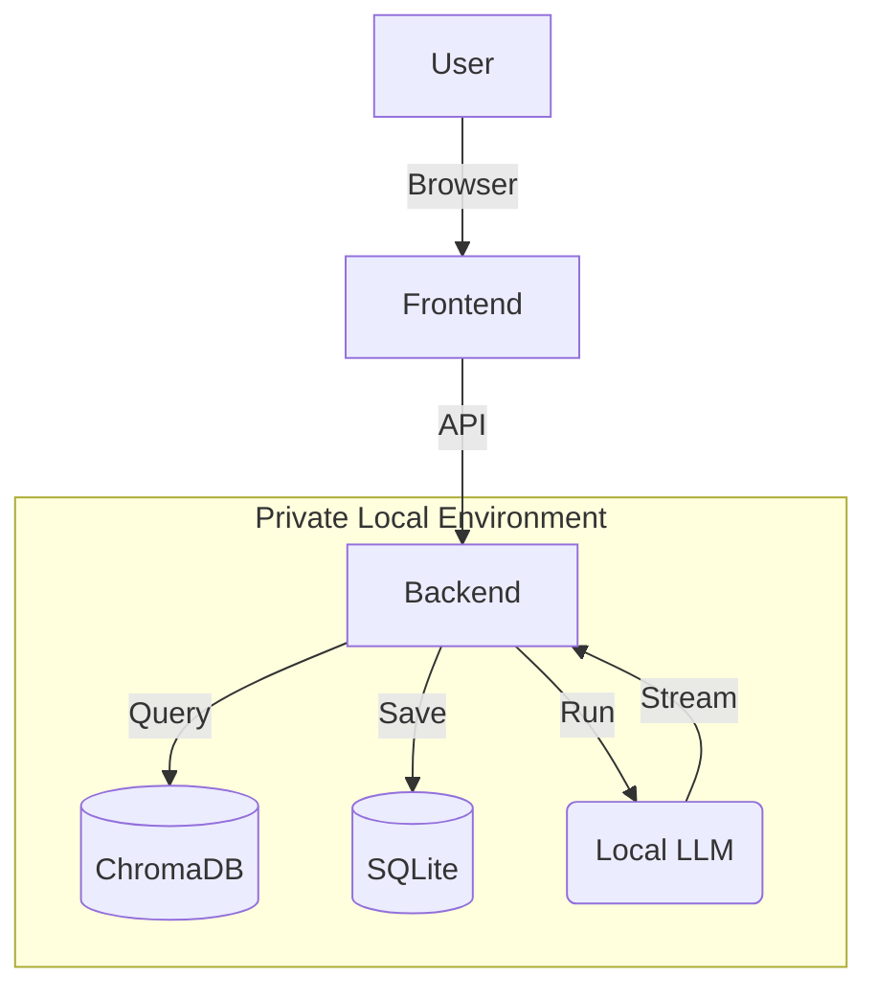

# Executive Insights Engine 🧠💼

> **100% Private, Local RAG for Strategic Decision Making.**

The **Executive Insights Engine** is a local-first Retrieval Augmented Generation (RAG) system designed for handling sensitive documents. It allows you to chat with your PDFs and generate deep research reports without your data ever leaving your machine.


## ✨ Key Features

*   **🔒 Complete Privacy**: Runs entirely offline using **Ollama** (`gemma3:1b`). No API keys, no cloud data leaks.
*   **🧠 Deep Research Agent**: Specify a topic, and the AI plans research, executes multiple searches, and writes a comprehensive Markdown report.
*   **🎨 Premium Interface**: "Midnight Glass" aesthetic with fluid animations, designed for a high-end executive experience.
*   **💾 Persistent History**: Automatically saves your chat sessions and reports (SQLite).
*   **🛡️ Secure & Robust**: Integrated Rate Limiting (`slowapi`) and input validation.
*   **🐋 Docker Ready**: Deploy anywhere with a single `docker-compose up`.

---

## 🛠️ Architecture



## 🚀 Quick Start

### Prerequisites
1.  **Ollama**: [Download & Install](https://ollama.com)
2.  **Pull Models**:
    ```bash
    ollama pull gemma3:1b
    ollama pull embeddinggemma
    ```

### Option A: Docker (Recommended)
You only need Docker and Ollama installed.

1.  **Run the Stack**:
    ```bash
    docker-compose up --build
    ```
2.  **Access App**: Open [http://localhost:5173](http://localhost:5173)

### Option B: Manual Setup

#### 1. Backend
```bash
cd backend
python -m venv venv
# Activate venv (Windows: .\venv\Scripts\activate, Mac/Linux: source venv/bin/activate)
pip install -r requirements.txt
uvicorn app.main:app --reload --port 8000
```

#### 2. Frontend
```bash
cd frontend
npm install
npm run dev
```

---

## 💡 Usage Guide

### 1. The Knowledge Base
*   Click **"New Document"** in the sidebar to upload PDF reports.
*   The system chunks and indexes them using `embeddinggemma`.

### 2. Chat Mode
*   Ask questions like *"Summarize the Q3 financial risks"*.
*   The system cites specific documents for every claim.

### 3. Report Agent (New)
*   Toggle **"Report Agent"** mode (top right).
*   Enter a broad topic: *"Analyze the competitor landscape based on uploaded docs"*.
*   Watch as it:
    1.  **Plans** a research strategy.
    2.  **Executes** targeted searches.
    3.  **Writes** a synthesized Executive Brief.

---

## 🏗️ Tech Stack

*   **Frontend**: React, Vite, Tailwind CSS (Glassmorphism), Lucide Icons.
*   **Backend**: FastAPI, Uvicorn, SQLAlchemy, SlowAPI.
*   **AI/RAG**: LangChain, ChromaDB, Ollama.
*   **Database**: SQLite (Relational), Chroma (Vector).

## 🛡️ Security Note
This project is hardcoded to allow CORS from `*` for development convenience. For production deployment, update `app/main.py` to whitelisting specific domains.
